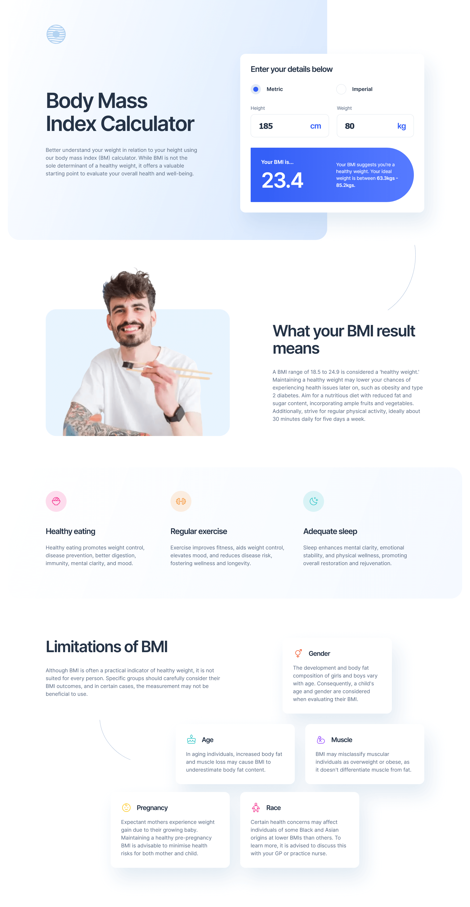
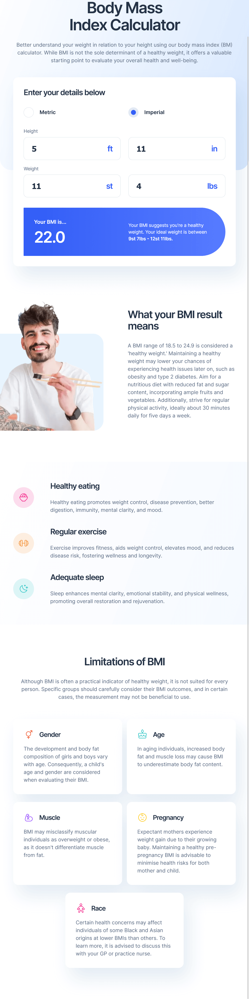
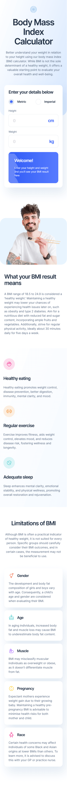

# Frontend Mentor - Body Mass Index Calculator solution

This is a solution to the [Body Mass Index Calculator challenge on Frontend Mentor](https://www.frontendmentor.io/challenges/body-mass-index-calculator-brrBkfSz1T). Frontend Mentor challenges help you improve your coding skills by building realistic projects.

## Table of contents

- [Overview](#overview)
  - [The challenge](#the-challenge)
  - [Screenshot](#screenshot)
  - [Links](#links)
- [My process](#my-process)
  - [Built with](#built-with)
  - [What I learned](#what-i-learned)
- [Author](#author)

## Overview

### The challenge

Users should be able to:

- Select whether they want to use metric or imperial units
- Enter their height and weight
- See their BMI result, with their weight classification and healthy weight range
- View the optimal layout for the interface depending on their device's screen size
- See hover and focus states for all interactive elements on the page

### Screenshot

Desktop

---

Tablet

---

Mobile

### Links

- Solution URL: [https://github.com/mihalymarcell86/bmi-calculator](https://github.com/mihalymarcell86/bmi-calculator)
- Live Site URL: [https://bmi-calculator-beryl-eight.vercel.app/](https://bmi-calculator-beryl-eight.vercel.app/)

## My process

### Built with

- Semantic HTML5 markup
- Mobile-first workflow
- [Sass](https://sass-lang.com/) - CSS Pre-processor
- CSS custom properties
- [CSS Modules](https://github.com/css-modules/css-modules)
- [React](https://reactjs.org/) - JS library
- [Vite.js](https://vitejs.dev/) - Frontend Tooling Library

### What I learned

I found the glob import feature of Vite.js very useful for importing multiple modules from the file system.
[See documentation](https://vitejs.dev/guide/features#glob-import)

I came across a strange behavior of typed input fields. `<input type='number'>` allows the input of non-numeric characters, however the entered value is not passed on to the handling function in a controlled component. I removed the type attribute and configured masking instead.

## Author

- GitHub - [@mihalymarcell86](https://www.github.com/mihalymarcell86)
- Frontend Mentor - [@mihalymarcell86](https://www.frontendmentor.io/profile/mihalymarcell86)
